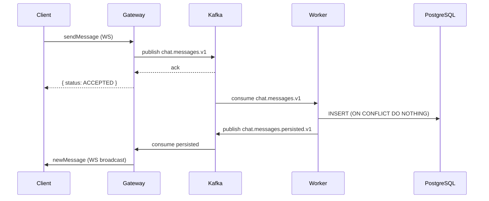

# nest-ws-toy

NestJS 모노레포 기반 실시간 채팅 시스템. WebSocket, Kafka, PostgreSQL, Valkey를 조합해 **at-least-once 메시지 전달**을 보장한다. 토이 프로젝트이지만 운영 가능한 품질을 목표로 한다.

---

## 목차

1. [프로젝트 소개](#1-프로젝트-소개)
2. [기술 스택](#2-기술-스택)
3. [아키텍처 개요](#3-아키텍처-개요)
4. [메시지 플로우](#4-메시지-플로우)
5. [설계 의사결정](#5-설계-의사결정)
6. [로컬 실행 가이드](#6-로컬-실행-가이드)
7. [API 엔드포인트](#7-api-엔드포인트)
8. [WebSocket 이벤트](#8-websocket-이벤트)
9. [프로젝트 구조](#9-프로젝트-구조)
10. [상세 문서](#10-상세-문서)

---

## 1. 프로젝트 소개

### 핵심 요구사항

| 항목 | 설명 |
|------|------|
| 실시간 채팅 | Socket.IO 기반 WebSocket 그룹 채팅 |
| At-Least-Once 전달 | Kafka publish 성공 후에만 클라이언트에 ACK |
| 중복 제거 | DB unique constraint + `clientMsgId`로 중복 저장/렌더링 방지 |
| 재접속 동기화 | ULID cursor 기반 REST API로 미수신 메시지 복구 |
| Presence | Redis TTL 기반 온라인 상태 관리 |

### 운영 품질 기준

- 메시지 중복 전송/저장을 정상 시나리오로 처리
- Consumer 재처리에도 DB unique constraint로 데이터 정합성 유지
- 재접속 시 누락 메시지 REST cursor로 복구
- 환경변수 누락 시 앱 기동 즉시 실패 (Zod 검증)
- Graceful shutdown으로 WS 연결 정리

---

## 2. 기술 스택

| 분류 | 기술 | 버전 |
|------|------|------|
| 프레임워크 | NestJS (Monorepo) | ^11 |
| ORM | TypeORM | ^0.3 |
| DB | PostgreSQL | 15 |
| Cache/Presence | Valkey 8 (ioredis) | ^5 |
| 메시지 큐 | Kafka (KRaft, KafkaJS) | 3.7 |
| 실시간 통신 | Socket.IO | ^4 |
| 입력 검증 | Zod | ^4 |
| 인증 | JWT (passport-jwt) | - |
| ID 생성 | ULID | ^3 |
| 헬스체크 | @nestjs/terminus | ^11 |

---

## 3. 아키텍처 개요

```
┌─────────────────────────────────────────────────────────────┐
│                        Client                               │
│              REST (HTTP) + WebSocket (Socket.IO)            │
└────────────────────────┬────────────────────────────────────┘
                         │
┌────────────────────────▼────────────────────────────────────┐
│                   apps/chat-gateway                         │
│  - REST API (Auth, Rooms, Messages, Health)                 │
│  - WebSocket Gateway (Socket.IO)                            │
│  - Kafka Producer (chat.messages.v1)                        │
│  - Kafka Consumer (chat.messages.persisted.v1 → broadcast)  │
│  - Redis Presence (setOnline / refreshTTL / setOffline)     │
└──────────┬────────────────────────────────┬─────────────────┘
           │ Kafka                          │ Redis
           │ chat.messages.v1               │ presence:user:{id}
           ▼                                │
┌──────────────────────┐                    │
│   apps/chat-worker   │                    │
│  - Kafka Consumer    │                    │
│    (chat-persistor)  │                    │
│  - DB INSERT + dedup │                    │
│  - Kafka Producer    │                    │
│    (persisted.v1)    │                    │
└──────────┬───────────┘                    │
           │ TypeORM                        │ ioredis
           ▼                                ▼
┌──────────────────┐             ┌──────────────────┐
│   PostgreSQL 15  │             │    Valkey 8      │
│  users           │             │  presence keys   │
│  rooms           │             │  (TTL 60s)       │
│  room_members    │             └──────────────────┘
│  messages        │
└──────────────────┘
```

### 공유 라이브러리

| 라이브러리 | 역할 |
|-----------|------|
| `libs/common` | DTO, Kafka 이벤트 스키마, ULID/pagination 유틸 |
| `libs/db` | TypeORM 엔티티 (User, Room, RoomMember, Message), DB 모듈 |
| `libs/redis` | ioredis 기반 Redis 모듈 |

---

## 4. 메시지 플로우



### 단계별 설명

1. **Client → Gateway**: 클라이언트가 `sendMessage` WS 이벤트로 메시지 전송 (`clientMsgId` 포함)
2. **Gateway → Kafka**: `chat.messages.v1` 토픽에 publish (key=roomId, acks=all)
3. **Gateway → Client**: publish 성공 시 `{ clientMsgId, status: 'ACCEPTED' }` ACK 반환
4. **Worker consume**: `chat-persistor` 그룹이 이벤트 consume
5. **Worker → PostgreSQL**: `ON CONFLICT DO NOTHING`으로 중복 없이 INSERT
6. **Worker → Kafka**: DB 저장 성공 시 `chat.messages.persisted.v1` 발행
7. **Gateway consume**: `chat-broadcast` 그룹이 persisted 이벤트 수신
8. **Gateway → Client**: 해당 room의 모든 온라인 멤버에게 `newMessage` broadcast

---

## 5. 설계 의사결정

### At-Least-Once 전달

Kafka `acks=all` + `idempotent=true` + `retries=3` 설정으로 producer 전송을 보장한다. publish 성공 후에만 클라이언트에 ACK를 반환한다. Consumer 재처리 시에도 DB unique constraint가 중복 저장을 차단한다.

### 중복 제거 전략

두 레이어에서 중복을 제거한다.

| 레이어 | 방식 |
|--------|------|
| DB | `UNIQUE(room_id, sender_id, client_msg_id)` + `ON CONFLICT DO NOTHING` |
| 클라이언트 | `clientMsgId`로 중복 렌더링 방지 |

try-catch 방식이 아닌 `queryBuilder.orIgnore()`를 사용해 충돌을 조용히 무시한다. 중복은 오류가 아니라 정상 시나리오다.

### 재접속 동기화

ULID는 시간순 정렬이 가능한 ID다. 재접속 후 `GET /rooms/:roomId/messages?after={lastSeenId}` 한 번으로 미수신 메시지를 전부 복구한다.

### Redis Presence

| 항목 | 값 |
|------|-----|
| 키 | `presence:user:{userId}` (Hash) |
| TTL | 60초 |
| Heartbeat | 20초마다 TTL 갱신 |
| Disconnect | 해당 socketId만 제거. 모든 socketId 소멸 시 offline |

`disconnect` 이벤트는 항상 수신되지 않는다. TTL 만료로 자동 offline 처리하는 방식이 실무에서 더 안정적이다. 복수 디바이스/탭은 socketId 단위로 관리한다.

### Kafka 토픽 설계

| 토픽 | key | Consumer Group | 역할 |
|------|-----|----------------|------|
| `chat.messages.v1` | roomId | `chat-persistor` | DB 저장 |
| `chat.messages.persisted.v1` | roomId | `chat-broadcast` | Gateway broadcast |

key=roomId로 룸 단위 메시지 순서를 보장한다.

### Persisted Event Broadcast

Gateway가 `ACCEPTED` ACK 직후 바로 broadcast하면 DB에 아직 저장되지 않은 메시지가 화면에 노출될 수 있다. Worker가 DB 저장 성공 후 persisted 이벤트를 발행하고, Gateway가 이를 구독해 broadcast하는 2단계 방식으로 이 문제를 방지한다.

---

## 6. 로컬 실행 가이드

### 사전 조건

- Docker Desktop
- Node.js 20+
- pnpm

### 실행 순서

```bash
# 1. 인프라 실행 (PostgreSQL, Redis, Kafka, Kafka UI)
docker-compose up -d

# 2. 인프라 헬스체크 (모두 healthy 확인)
docker-compose ps

# 3. 환경변수 설정
cp .env.example .env

# 4. 의존성 설치
pnpm install

# 5. Gateway 실행 (포트 3000)
pnpm run start:gateway:dev

# 6. Worker 실행 (별도 터미널, 포트 3001)
pnpm run start:worker:dev
```

### 환경변수 (.env.example)

```env
# Database
DB_HOST=localhost
DB_PORT=5432
DB_USERNAME=chat
DB_PASSWORD=chat1234
DB_DATABASE=chat

# Redis
REDIS_HOST=localhost
REDIS_PORT=6379

# Kafka
KAFKA_BROKERS=localhost:29092

# JWT
JWT_SECRET=your-super-secret-jwt-key-change-in-production
JWT_EXPIRES_IN=1d

# App
PORT=3000
WORKER_PORT=3001
```

### 빌드

```bash
# 전체 빌드
pnpm run build

# 앱별 빌드
pnpm run build:gateway
pnpm run build:worker
```

### 테스트

```bash
# 단위 테스트
pnpm run test

# 커버리지 포함
pnpm run test:cov

# E2E 테스트 (docker-compose 인프라 필요)
pnpm test:e2e
```

E2E 테스트는 실제 PostgreSQL + Redis를 사용하며, Kafka는 mock 처리한다. `supertest`로 HTTP API, `socket.io-client`로 WebSocket 이벤트를 검증한다.

### 관리 UI

| UI | URL | 용도 |
|----|-----|------|
| Kafka UI | `http://localhost:8080` | 토픽, 메시지, 컨슈머 그룹 모니터링 |
| Redis Commander | `http://localhost:8081` | Valkey 키 브라우징, 데이터 관리 |

---

## 7. API 엔드포인트

모든 인증 필요 엔드포인트는 `Authorization: Bearer {JWT}` 헤더가 필요하다.

### 인증

| Method | Path | 인증 | Description |
|--------|------|------|-------------|
| POST | `/auth/register` | 불필요 | 회원가입 |
| POST | `/auth/login` | 불필요 | 로그인 (JWT 발급) |

### 방/멤버

| Method | Path | 인증 | Description |
|--------|------|------|-------------|
| POST | `/rooms` | 필요 | 방 생성 |
| POST | `/rooms/:roomId/join` | 필요 | 방 참여 |
| GET | `/rooms` | 필요 | 내 방 목록 조회 |
| GET | `/rooms/:roomId/members` | 필요 | 방 멤버 목록 조회 |

### 메시지

| Method | Path | 인증 | Description |
|--------|------|------|-------------|
| GET | `/rooms/:roomId/messages` | 필요 | 메시지 히스토리 (cursor 기반) |
| POST | `/rooms/:roomId/read` | 필요 | 읽음 커서 업데이트 |

**메시지 히스토리 쿼리 파라미터**

| 파라미터 | 설명 |
|----------|------|
| `before={messageId}&limit=50` | 해당 ID 이전 메시지 (과거 탐색) |
| `after={messageId}&limit=50` | 해당 ID 이후 메시지 (재접속 동기화) |

### 운영

| Method | Path | 인증 | Description |
|--------|------|------|-------------|
| GET | `/health` | 불필요 | 헬스체크 (DB, Redis, Kafka) |

---

## 8. WebSocket 이벤트

Socket.IO 연결 시 handshake 헤더에 `Authorization: Bearer {JWT}`가 필요하다. 인증 실패 시 즉시 disconnect된다.

### Client → Server

| Event | Payload | Description |
|-------|---------|-------------|
| `joinRoom` | `{ roomId: string }` | 방 참여 (Socket.IO room join) |
| `sendMessage` | `{ roomId, clientMsgId, content, type }` | 메시지 전송 |
| `heartbeat` | `{}` | Presence TTL 갱신 (20초마다 권장) |

### Server → Client

| Event | Payload | Description |
|-------|---------|-------------|
| `messageAccepted` | `{ clientMsgId, status: 'ACCEPTED' }` | 메시지 Kafka publish 성공 ACK |
| `messageFailed` | `{ clientMsgId, status: 'FAILED' }` | 메시지 publish 실패 |
| `newMessage` | `{ id, roomId, senderId, content, type, createdAt }` | 새 메시지 broadcast (DB 저장 후) |

---

## 9. 프로젝트 구조

```
nest-ws-toy/
├── docker-compose.yml
├── nest-cli.json
├── package.json
├── tsconfig.json
├── tsconfig.build.json
├── .env.example
├── apps/
│   ├── chat-gateway/
│   │   ├── test/
│   │   │   ├── jest-e2e.json          # E2E 테스트 Jest 설정
│   │   │   ├── app.e2e-spec.ts        # HTTP API E2E 테스트
│   │   │   └── ws.e2e-spec.ts         # WebSocket E2E 테스트
│   │   └── src/
│   │       ├── main.ts
│   │       ├── app.module.ts
│   │       ├── auth/               # JWT 인증 (register, login, guard)
│   │       ├── rooms/              # 방 생성/참여/목록 REST API
│   │       ├── messages/           # 메시지 히스토리, 읽음 커서 REST API
│   │       ├── gateway/            # Socket.IO WebSocket Gateway
│   │       ├── presence/           # Redis presence 서비스
│   │       └── health/             # @nestjs/terminus 헬스체크
│   └── chat-worker/
│       └── src/
│           ├── main.ts
│           ├── app.module.ts
│           ├── persistor/          # Kafka consumer → DB INSERT + dedup
│           └── fanout/             # DB 저장 후 persisted 이벤트 발행
└── libs/
    ├── common/
    │   └── src/
    │       ├── dto/                # auth.dto, room.dto, message.dto, ws-events.dto
    │       ├── events/             # message-created.event, message-persisted.event
    │       └── utils/              # ulid.ts, pagination.ts
    ├── db/
    │   └── src/
    │       ├── db.module.ts
    │       └── entities/           # User, Room, RoomMember, Message 엔티티
    └── redis/
        └── src/
            └── redis.module.ts     # ioredis 동적 모듈
```

### 핵심 파일

| 파일 | 역할 |
|------|------|
| `apps/chat-gateway/src/gateway/chat.gateway.ts` | WS 연결, sendMessage, broadcast |
| `apps/chat-gateway/src/presence/presence.service.ts` | Redis presence CRUD |
| `apps/chat-worker/src/persistor/persistor.service.ts` | Kafka consume → DB INSERT |
| `apps/chat-worker/src/fanout/fanout.service.ts` | persisted 이벤트 발행 |
| `libs/db/src/entities/message.entity.ts` | ULID PK, unique constraint 정의 |
| `libs/common/src/events/` | Kafka 이벤트 스키마 (v1) |

---

## 10. 상세 문서

| # | 문서 | 내용 |
|---|------|------|
| 01 | [Architecture Overview](docs/01-architecture-overview.md) | 시스템 구성도, Gateway/Worker 독립 구조, 스케일링 |
| 02 | [Message Flow](docs/02-message-flow.md) | 메시지 시퀀스, Kafka 토픽 설계, 이벤트 스키마 |
| 03 | [Data Model](docs/03-data-model.md) | TypeORM 엔티티, 테이블 관계, 인덱스 |
| 04 | [WebSocket Guide](docs/04-websocket-guide.md) | Socket.IO 인증, 이벤트, Presence, 브로드캐스트 |
| 05 | [API Reference](docs/05-api-reference.md) | REST API 엔드포인트 상세 |
| 06 | [NestJS Patterns](docs/06-nestjs-patterns.md) | DI, 동적 모듈, Guard, Pipe, 마이크로서비스 패턴 |
| 07 | [Design Decisions](docs/07-design-decisions.md) | 아키텍처 결정 근거 |
| 08 | [Improvements](docs/08-improvements.md) | 개선 이력 및 향후 과제 |
| 09 | [Testing](docs/09-testing.md) | 테스트 전략, mock 패턴, 커버리지 |
| 10 | [Redis Keys](docs/10-redis-keys.md) | Valkey 키 구조, 자료형, TTL, 저장 예시 |
