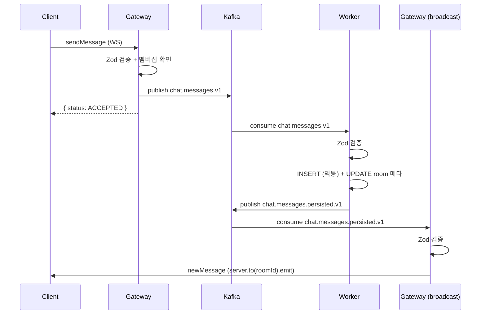

# Message Flow (메시지 흐름)

## 전체 시퀀스



## 단계별 상세

### 1단계: 클라이언트 → Gateway (WebSocket)

**파일**: `apps/chat-gateway/src/gateway/chat.gateway.ts:102-141`

1. 클라이언트가 `sendMessage` 이벤트를 Socket.IO로 전송
2. `SendMessageSchema`로 Zod 검증 (roomId, clientMsgId, type, content)
3. `roomsService.isMember()`로 방 멤버십 확인
4. `MessageCreatedEvent` 구성:

   ```typescript
   {
     eventId: randomUUID(),     // 이벤트 고유 ID
     roomId: dto.roomId,
     senderId: client.user.userId,
     clientMsgId: dto.clientMsgId,  // 클라이언트가 생성한 중복 제거용 ID
     messageType: dto.type,
     content: dto.content,
     producedAt: new Date().toISOString(),
   }
   ```

5. Kafka `chat.messages.v1` 토픽에 발행 (key = roomId)
6. 클라이언트에 `{ clientMsgId, status: 'ACCEPTED' }` ACK 반환

### 2단계: Kafka → Worker (DB 저장)

**파일**: `apps/chat-worker/src/persistor/persistor.service.ts:24-57`

1. `PersistorController`가 `chat.messages.v1` 토픽에서 메시지 수신
2. `MessageCreatedEventSchema`로 Zod 검증
3. 트랜잭션 내에서:
   - ULID 생성: `const messageId = generateUlid()`
   - `INSERT ... ON CONFLICT DO NOTHING` — `(roomId, senderId, clientMsgId)` 유니크 제약으로 중복 방지
   - 중복이 아닌 경우 `rooms` 테이블의 `lastMessageId`, `lastMessageAt` 업데이트
4. 저장 성공 시 `MessagePersistedEvent`를 `chat.messages.persisted.v1` 토픽에 발행

### 3단계: Kafka → Gateway (브로드캐스트)

**파일**: `apps/chat-gateway/src/gateway/broadcast.controller.ts:12-34`

1. `BroadcastController`가 `chat.messages.persisted.v1` 토픽에서 이벤트 수신
2. `MessagePersistedEventSchema`로 Zod 검증
3. Socket.IO 룸에 브로드캐스트:

   ```typescript
   this.chatGateway.server.to(event.roomId).emit('newMessage', {
     messageId, roomId, senderId, clientMsgId, type, content, createdAt
   });
   ```

## Kafka 토픽 설계

| 토픽 | 파티션 | Key | Producer | Consumer | 용도 |
|------|--------|-----|----------|----------|------|
| `chat.messages.v1` | 3 | roomId | Gateway | Worker (chat-persistor) | DB 저장 |
| `chat.messages.persisted.v1` | 3 | roomId | Worker | Gateway (chat-broadcast) | WS 브로드캐스트 |

**Key = roomId인 이유**: 같은 방의 메시지가 항상 같은 파티션에 들어가므로, 방 내 메시지 순서가 보장됩니다.

### 왜 토픽이 2개인가?

Gateway가 직접 DB에 저장하고 브로드캐스트하면 토픽 1개로 충분하지만, **쓰기와 읽기를 분리**하기 위해 2개를 사용한다.

```
chat.messages.v1           →  "저장해줘" (미확인 메시지)
chat.messages.persisted.v1 →  "저장됐어" (DB 확정 메시지)
```

이 분리로 얻는 이점:

- **Gateway는 DB에 의존하지 않음**: 메시지 수신 → Kafka 발행 → 즉시 ACK. DB 장애가 WebSocket 응답 지연으로 이어지지 않음
- **Worker 독립 스케일링**: DB 쓰기 부하가 커지면 Worker만 증설
- **브로드캐스트 신뢰성**: `persisted.v1`에 담긴 메시지는 DB에 확정된 것이므로, 클라이언트에 전달 후 조회해도 항상 존재

### chat.messages.v1 (미확인 메시지)

**방향**: Gateway → Worker

**의미**: 클라이언트가 보낸 메시지. 아직 DB에 저장되지 않은 상태.

**이벤트 스키마** (`MessageCreatedEvent`):

```typescript
{
  eventId: string      // 이벤트 고유 ID (UUID)
  roomId: string       // 방 ID (파티션 키로도 사용)
  senderId: string     // 발신자 ID
  clientMsgId: string  // 클라이언트가 생성한 중복 제거용 ID
  messageType: 'TEXT' | 'IMAGE' | 'SYSTEM'
  content: string      // 메시지 내용
  producedAt: string   // Gateway에서 발행한 시각 (ISO 8601)
}
```

**소스**: `libs/common/src/events/message-created.event.ts`

### chat.messages.persisted.v1 (확정 메시지)

**방향**: Worker → Gateway

**의미**: DB에 저장 완료된 메시지. ULID 기반 `messageId`와 DB 타임스탬프가 부여된 상태.

**이벤트 스키마** (`MessagePersistedEvent`):

```typescript
{
  messageId: string    // DB에서 생성된 ULID (시간순 정렬 가능)
  roomId: string       // 방 ID
  senderId: string     // 발신자 ID
  clientMsgId: string  // 원본 클라이언트 메시지 ID
  messageType: string  // 메시지 타입
  content: string      // 메시지 내용
  createdAt: string    // DB INSERT 시각 (ISO 8601)
}
```

**소스**: `libs/common/src/events/message-persisted.event.ts`

### 두 이벤트의 차이점

| 필드 | `MessageCreatedEvent` | `MessagePersistedEvent` |
|------|----------------------|------------------------|
| ID | `eventId` (이벤트 추적용) | `messageId` (DB 레코드 ULID) |
| 시각 | `producedAt` (Gateway 발행 시점) | `createdAt` (DB 저장 시점) |
| 상태 | 미확인 (DB 저장 전) | 확정 (DB 저장 완료) |

## 신뢰성 보장

### At-Least-Once Delivery

- Gateway Producer: `idempotent: true` → `acks=all` 자동 적용
- Worker에서 에러 발생 시 `throw error`로 offset commit 방지 → 재시도

### 멱등 저장 (Deduplication)

- DB 유니크 제약: `UNIQUE(room_id, sender_id, client_msg_id)`
- `INSERT ... ON CONFLICT DO NOTHING`으로 중복 무시
- 중복 감지 시 fanout 스킵

### 클라이언트 중복 제거

- 클라이언트가 `clientMsgId`를 생성 (UUID)
- `seenClientMsgIds` Set으로 동일 메시지의 중복 렌더링 방지
