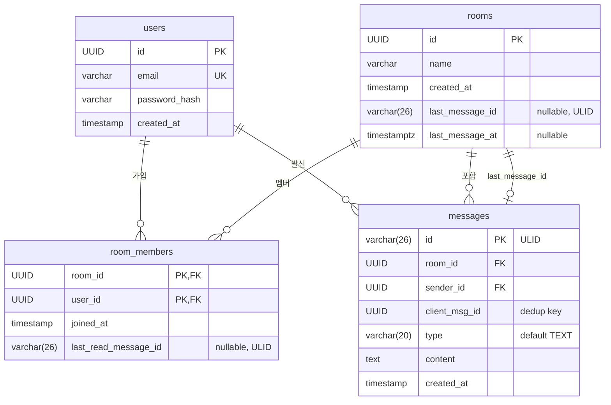

# Data Model (데이터 모델)

## ER 다이어그램

## 엔티티 상세

### User (`libs/db/src/entities/user.entity.ts`)

| 컬럼 | 타입 | 설명 |
|------|------|------|
| `id` | UUID (PK, auto) | 사용자 고유 ID |
| `email` | varchar (UNIQUE) | 이메일 주소 |
| `password_hash` | varchar | bcrypt 해시 (salt rounds: 10) |
| `created_at` | timestamp | 생성 시각 |

### Room (`libs/db/src/entities/room.entity.ts`)

| 컬럼 | 타입 | 설명 |
|------|------|------|
| `id` | UUID (PK, auto) | 방 고유 ID |
| `name` | varchar | 방 이름 |
| `created_at` | timestamp | 생성 시각 |
| `last_message_id` | varchar(26), nullable | 마지막 메시지 ULID (비정규화) |
| `last_message_at` | timestamptz, nullable | 마지막 메시지 시각 (비정규화) |

`last_message_id`와 `last_message_at`는 방 목록을 최근 활동순으로 정렬하기 위한 비정규화 필드.

### RoomMember (`libs/db/src/entities/room-member.entity.ts`)

| 컬럼 | 타입 | 설명 |
|------|------|------|
| `room_id` | UUID (PK) | 방 ID |
| `user_id` | UUID (PK) | 사용자 ID |
| `joined_at` | timestamp | 입장 시각 |
| `last_read_message_id` | varchar(26), nullable | 마지막 읽은 메시지 ULID (읽음 커서) |

복합 PK `(room_id, user_id)`로 같은 방에 같은 사용자가 중복 가입할 수 없음.

### Message (`libs/db/src/entities/message.entity.ts`)

| 컬럼 | 타입 | 설명 |
|------|------|------|
| `id` | varchar(26) (PK) | ULID — 시간순 정렬 가능 |
| `room_id` | UUID | 방 ID |
| `sender_id` | UUID | 발신자 ID |
| `client_msg_id` | UUID | 클라이언트 생성 중복 제거용 ID |
| `type` | varchar(20), default 'TEXT' | 메시지 타입 (TEXT, IMAGE, SYSTEM) |
| `content` | text | 메시지 내용 |
| `created_at` | timestamp | 생성 시각 |

**인덱스 & 제약조건**:
- `UQ_messages_dedup`: UNIQUE(`room_id`, `sender_id`, `client_msg_id`) — 멱등 저장
- `IDX_messages_room_id`: INDEX(`room_id`, `id`) — 커서 기반 페이지네이션 최적화

## ULID를 사용하는 이유

1. **시간순 정렬**: 앞 48비트가 밀리초 타임스탬프 → 사전순 = 시간순
2. **커서 페이지네이션**: `WHERE id < :before` 또는 `WHERE id > :after`로 효율적 조회
3. **분산 생성**: DB 시퀀스 없이 애플리케이션에서 생성 가능
4. **고정 길이**: 26자 문자열

## 비정규화 전략

- `rooms.last_message_id/at`: 방 목록 조회 시 최신 메시지 정보를 JOIN 없이 제공
- `room_members.last_read_message_id`: 안 읽은 메시지 수 계산에 활용 (ULID 비교)
